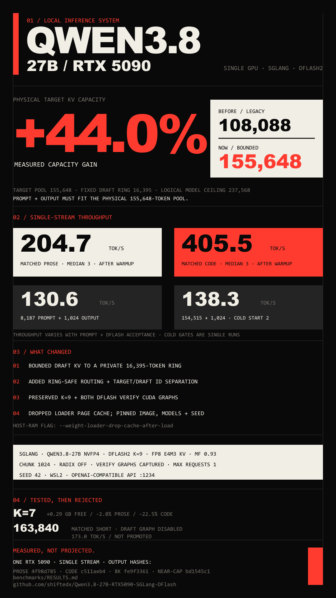

# Qwen3.8 27B on one RTX 5090 with SGLang DFlash

Portable WSL launch tooling for the NVFP4 Qwen3.8 target and DFlash2 draft
model. It builds a pinned SGLang image with a bundled bounded-DFlash patch,
then serves an OpenAI-compatible endpoint on one RTX 5090.



This repository contains no model weights, Docker layers, credentials, logs,
or benchmark JSONL. Downloading models is subject to their model-card terms:
[target](https://huggingface.co/gittensor-model-hub/Qwen3.8-27B-NVFP4-RTX5090-LMHead4),
[draft](https://huggingface.co/z-lab/Qwen3.8-27B-DFlash2), and
[Qwen base](https://huggingface.co/Qwen/Qwen3.8-27B). It also uses [SGLang](https://github.com/sgl-project/sglang).

The CPU-only GitHub Actions definition is shipped as
[`ci/github-actions.yml`](ci/github-actions.yml). Copy it to
`.github/workflows/ci.yml` to enable the Linux and Windows contract jobs in a
fork.

## Prerequisites

- Windows 11 with WSL2 Ubuntu, stored under the WSL user's Linux home
  filesystem (not `/mnt/c`).
- An NVIDIA RTX 5090 visible as `nvidia-smi` inside WSL, 30,000 MiB free VRAM,
  and at least 70 GB free under the model root.
- Git, network access to GitHub, Docker Hub, and Hugging Face. Set `HF_TOKEN`
  in your shell if either model requires it; it is forwarded only into the
  download process environment and is never printed or persisted.

`scripts/setup_runtime.sh` installs Docker and NVIDIA Container Toolkit; it
does **not** install a Linux NVIDIA driver. Install/update the Windows NVIDIA
driver first if WSL cannot see the GPU.

## Quick start

Run these commands in Ubuntu WSL. The clone location is the default portable
deployment root; use the generated ignored `profile.env` to choose another
ext4 deploy root, model root, profile name, port, or container name.

```bash
cd ~
git clone https://github.com/shiftedx/Qwen3.8-27B-RTX5090-SGLang-DFlash.git
cd Qwen3.8-27B-RTX5090-SGLang-DFlash
bash scripts/setup_runtime.sh
exit
```

Open a **new Ubuntu WSL session** (Docker group membership is refreshed only
for new sessions), then continue without `sudo`:

```bash
cd ~/Qwen3.8-27B-RTX5090-SGLang-DFlash
docker info
read -rsp 'Hugging Face token (input hidden; press Enter to skip): ' HF_TOKEN; echo
export HF_TOKEN
bash scripts/setup_profile.sh
bash scripts/server.sh start
```

The token value is typed only after the session refresh, is hidden from the
terminal, and is not placed as a literal in shell history. Run `unset HF_TOKEN`
after setup if you do not need it in that shell.

The endpoint is `http://127.0.0.1:1234/v1`, serving
`qwen3.8-27b-nvfp4`. Wait for startup and graph capture, then smoke-test it:

```bash
curl http://127.0.0.1:1234/v1/chat/completions \
  -H 'content-type: application/json' \
  -d '{"model":"qwen3.8-27b-nvfp4","messages":[{"role":"user","content":"Reply with exactly: ready"}],"max_tokens":16}'
```

## Profile and capacity semantics

The qualified profile is intentionally narrow: 155,648 target tokens,
16,395 draft tokens, DFlash `K=9`, draft window 16,384, FP8 E4M3 KV cache,
memory fraction 0.93, prefill chunk 1,024, radix cache off, prefill CUDA graph
off, both verification graphs captured, one running request, seed 42, port
1234, and page-cache drop after weight loading.

`CONTEXT_LENGTH=237568` is the model's logical ceiling. The physical target KV
pool is only 155,648 tokens, so **prompt plus generated output must fit within
155,648**. A request is not safe merely because it is below 237,568.

The image builder checks out SGLang
`a1fe4e30a983b04bbb74099dfc71bc7148c5c577`, checks the bundled patch against
that base, pins Docker base digest
`sha256:43816c14aaaf6a4d09b6d19e6bac9802774b23c43298d70552e93fd4d202848a`,
and verifies image provenance labels and bundled patch SHA-256
`d080d3e087f56c9cfb338f9a3302fde70baab26857a9c7df17b4987ab8187d53`.
The patch hash—not an unpublished/local source revision—is the authoritative
patch provenance; no machine-specific derived image identifier is required.

## Measured performance

All figures were measured on **one RTX 5090, single stream**. They are prompt-
and DFlash-acceptance-dependent, not a general throughput promise.

| Workload | Result |
| --- | ---: |
| Matched short-context prose at 152 Ki (3-run median after one warmup) | 204.7 tok/s |
| Matched short-context code at 152 Ki (3-run median after one warmup) | 405.5 tok/s |
| 8,187-token input + 1,024-token output (one production cold-start gate) | 130.6 tok/s |
| 154,515-token input + 1,024-token output (second production cold-start repeat) | 138.3 tok/s |

Methodology: the two short-context rows used sequential streaming, one active
request, one discarded warm-up, then three measured runs; report decode
tokens/second after the first reasoning or content token. The 8K+1K result is
one production cold-start gate whose hash matches the Task 6 bounded/legacy
parity result, not a median. The near-cap row is the second production
cold-start repeat: its hash matches the first, whose rates were 138.65 and
138.34 tok/s respectively. See [benchmarks/RESULTS.md](benchmarks/RESULTS.md).
The included `matched-prose.txt` is the recovered prose prompt used for the
measured table. The included code prompt is a reproducible harness example;
the original measured code prompt was not recoverable and is not represented as
the table's exact input. Raw JSONL stays ignored:

```bash
python3 scripts/benchmark.py --label matched-prose \
  --prompt-file benchmarks/prompts/matched-prose.txt \
  --output .state/matched-prose.jsonl --warmups 1 --repeats 3 --max-tokens 512
python3 scripts/benchmark.py --label harness-code \
  --prompt-file benchmarks/prompts/harness-code.txt \
  --output .state/harness-code.jsonl --warmups 1 --repeats 3 --max-tokens 512
```

## Operations

```bash
bash scripts/server.sh start    # start
bash scripts/server.sh stop     # stop and remove container
bash scripts/server.sh status   # status
bash scripts/server.sh logs     # follow logs
bash scripts/server.sh resolve  # print resolved docker command without running it
bash scripts/keepalive.sh       # start and wait while the container runs
```

Install desktop launchers from PowerShell; the installer derives the WSL path
and accepts a non-default distro:

```powershell
.\windows\Install-Desktop-Launchers.ps1 -Distro Ubuntu -Force
```

## RAM behavior and rejected alternatives

The loader uses `--weight-loader-drop-cache-after-load`, so Linux page cache
used during loading is released. Model files remain on disk and GPU memory is
still the governing runtime capacity. Keep models and Docker data under WSL
ext4 for predictable IO and storage semantics.

The 163,840-token target-cache experiment was rejected as the default because
it did not retain the draft CUDA graph and reduced matched short-context speed
to 173.0 tok/s. The profile also rejects radix caching and prefill CUDA graphs:
the bounded target/draft allocation and both verification graphs are more
valuable for this one-stream DFlash configuration.

K=7 was also rejected: it recovered about 0.29 GB after graph capture but was
2.8% slower on prose and 22.5% slower on code.

## Troubleshooting

- **Preflight says non-ext4:** clone under `~` in WSL and set `DEPLOY_ROOT` and
  `MODEL_ROOT` in `profile.env` to ext4 paths.
- **No RTX 5090:** update the Windows NVIDIA driver and verify `nvidia-smi`
  from WSL. Do not install a Linux NVIDIA driver.
- **Token/download error:** export `HF_TOKEN` in the shell that runs setup;
  confirm access on the relevant model card.
- **Port busy:** edit `PORT` in ignored `profile.env`, then restart.
- **Out of capacity:** reduce prompt or output so their total stays at or below
  155,648 tokens.

## Attribution and license

This project is Apache-2.0; see [LICENSE](LICENSE) and [NOTICE](NOTICE). SGLang
and model attribution links, plus the no-weights statement, are in `NOTICE`.
